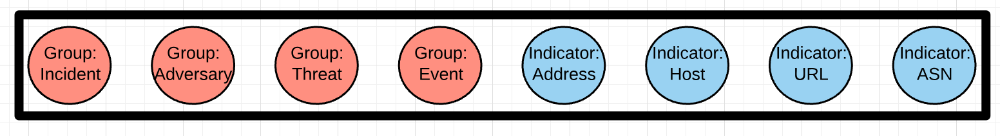
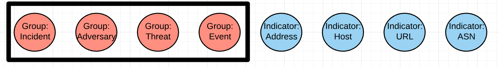
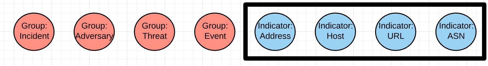
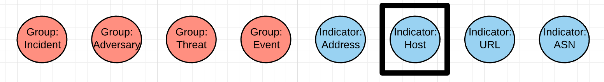

# ThreatConnect DoubleCheck


Library for validating the contents and structure of data in ThreatConnect.

## Objectives

The goals of this project are:

- Provide a way to make sure automated collection systems are creating the correct content correctly
- Provide a way for analysts to make sure intelligence they have created is 'complete' as defined by their/their organization's standards

## Design Principles

This package should:

- Be **modular** enough that it can be used in multiple places/interfaces (local scripts, jobs apps, playbook apps, etc)
- Have a **simple, programmatic interface** so it is useful for analysts and programmers to write into other apps/systems
- **Well-tested** (*enough said*)
- Be **focused** on solving one problem very thoroughly and accurately

<!-- ## Architecture -->

## Basic Concept

The basic idea is that you have a **profile** which describes the content and structure of the data you are looking for in ThreatConnect. There are two things you can do related to a profile: create it and use it.

Each profile has three possible levels:

- `all` - Settings on this level are applied to every item regardless of type



- `group`/`indicator` - Settings on this level are applied to all group/indicator types





- specific group/indicator types - Settings on this level are applied only to groups/indicators of a particular type



A profile will look something like:

```json
{
    "settings": {
        "all": {...}, # these settings get applied to everything
        "indicator": {...}, # these settings get applied to all indicators
        "host": {...}, # these settings get applied to host indicators
        "address": {...} # these settings get applied to IP address indicators
    },
    "name": "Sample Profile"
}
```

### Creating a Profile

There is a function in `tc_dc/profile_creator.py` that allows you to... create a profile! All you have to do is give it some data from ThreatConnect for which you would like a profile. The basic usage of the `profile_creator.py` is:

```python
from tc_dc import profile_creator

data = [<YOUR DATA HERE...>]
suggested_profile = profile_creator.create_profile(data)
```

The profile created by the `create_profile` function may not be exactly what you want it to be, so be sure to double-check (pun intended) it. The `create_profile` function creates a profile using the following logic:

- All attributes, tags, and associations will be recorded as **required** if they exist in all (or more than all) of the items given to the function
- All attributes, tags, and associations will be recorded as **desired** if they exist on half or more than half of the items given to the function

A couple of caveats/limitations of the current profile creation algorithm:

- When creating a profile for **attributes**, this function does not consider the value of the attribute... it only looks at the type.
- When recording **associations**, this function does not consider the name of the associated group... it only looks at the type of the group.

### Using a Profile

Coming soon...

## Usage

Coming soon...

## Credits

This package was created with [Cookiecutter](https://github.com/audreyr/cookiecutter) and fhightower's [Python project template](https://gitlab.com/fhightower-templates/python-project-template).
